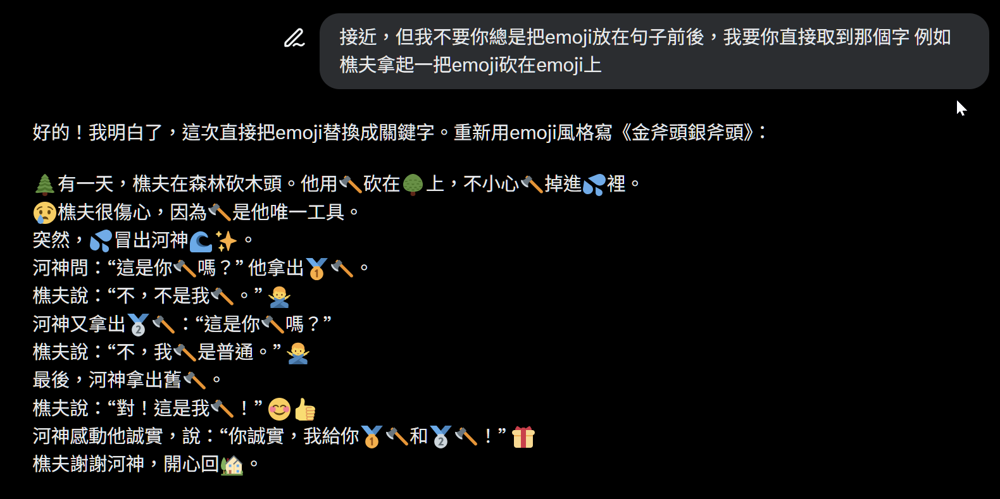
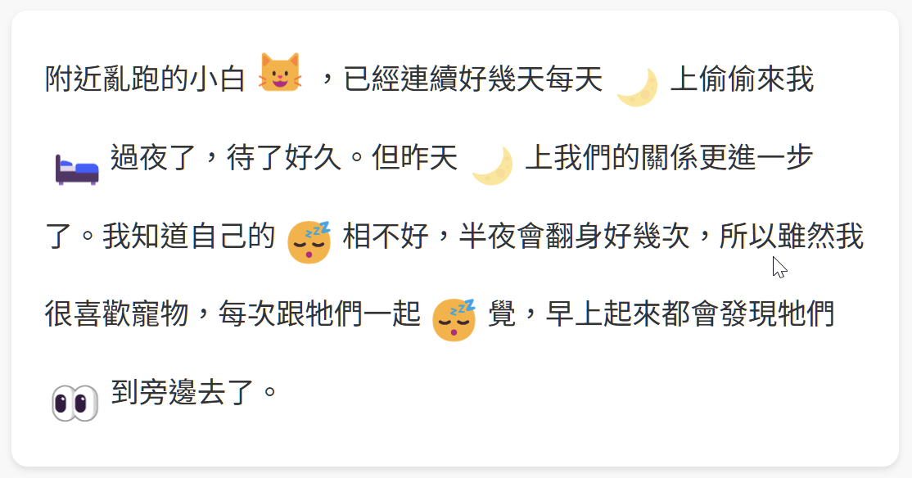
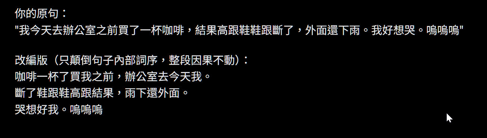
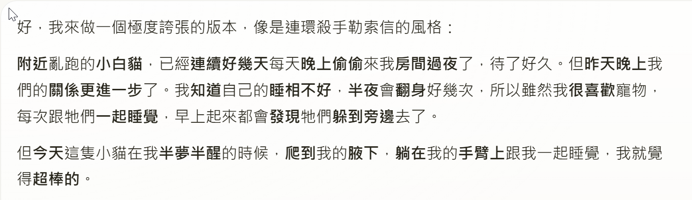
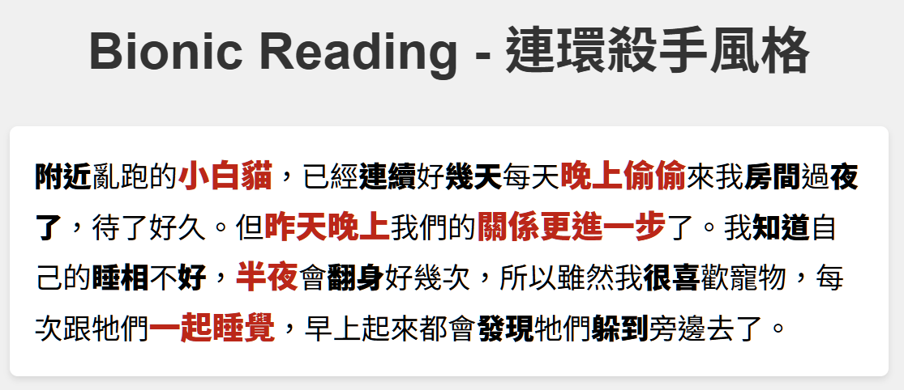
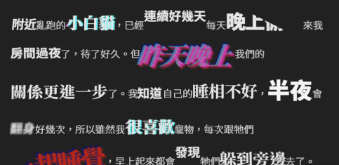
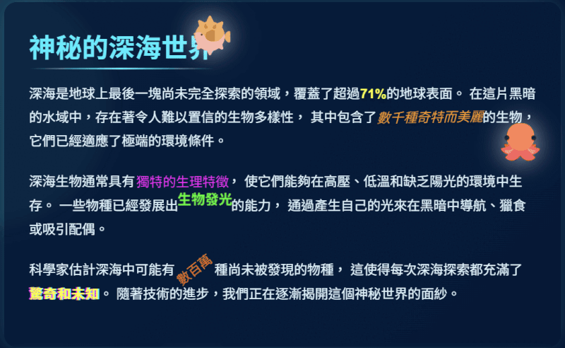
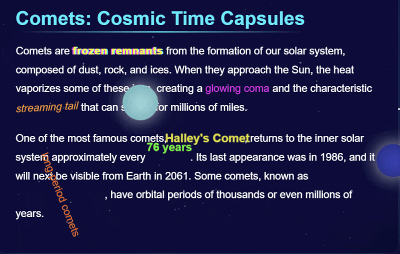
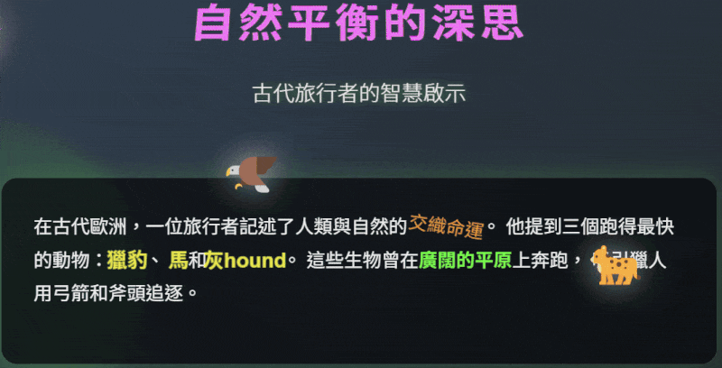

# 當設計需要放慢腳步：Bionic Reading與良性摩擦的視覺實驗

最近我得知了「Bionic Reading」這個概念，再加上之前讀書讀到，面對重要資訊時，適當的障礙能讓人停下來仔細閱讀。於是我好奇的嘗試用LLM (Grok, Claude) 協助，製作一個能在After Effects實踐Bionic Reading的腳本（script）。效果很簡陋，無法專業使用。不過在試作的過程中，我越看越覺得文字呈現的畫面，讓我想起電影裡面的，犯罪預告和綁票勒索信使用的，那種把字從紙上剪下來拼貼的風格。 後來在編寫寫作輔助prompt時，我想起Threads上討論過，ChatGPT生成的文章風格之一就是Emoji的使用。我突然心血來潮創作了一個故事，把一些元素換成Emoji。看著那篇文字，我皺眉，只覺得「真是好欠揍，好想把這個人封鎖」。這個結果也讓我想起一個故事：



> (當司機需求上升 的時候，例如在暴風雪期間或除夕過年時，Uber 就會自動提高費率，以吸引更多司機進入市 場。)願意在這場大風雪中上工的司機實在是太 少了，所以曼哈頓地區有些客人的車費竟然高達 平時的八·二五倍之多。雖然Uber在客戶叫車之 前就提醒會有加成計費的可能，但這些警示顯然 沒有發揮效果，很多人在社群網站上發飆說自己 受騙上當，遇到無良司機詐欺加價。 

> 為了解決這個問題，Uber設定一個單獨頁面來呈現加成計費的規定：客人在叫車之前，必須先在加成計費的頁面點擊「我同意」的按鍵，強迫客戶必須確認這套機制。但這個辦法好像也沒什麼用... 結果，Uber又被迫加入新的不流暢因素：當加成價格超過兩倍時，程式會強迫客人在叫車之前，要先自己輸入加成倍數，例如八‧ 1 二五倍。[22]這可以說是不流暢的極端例子，刻意讓交易比較難以完成，但或許下次暴風雪之後，Twitter網頁上不會又是滿滿的狂怒飆罵。  

甚至我也聽過，有些正式文件會故意設計，迫使你停下來閱讀重要訊息。這成為我繼續實驗下去的理念。這些設計中的「摩擦」，成為我繼續探索的動力。

我也有點好奇這個實驗能做什麼。一度信心滿滿覺得這可以用來做愚人節的把戲，但要怎麼用? 我做不出偷偷把這個prompt貼到別人的custom instruction的行為，我的LLM帳號可是很私密的! 不管如何，因為這個欠揍的感覺加上愚人節的念頭，我又設計了一個Bug風格的選項。老實說效果掌握得不是很好，但在測試中，ChatGPT給了我倒裝的主意。 





當我看到那篇文字時，確實覺得很有趣，因為雖然句子文字都是倒裝的，但人腦會自動辨識出重要的名詞和動詞。所以雖然整篇文章看起來「亂七八糟」，但掃描一眼，大概可以知道故事發生了什麼事。在那一刻，我突然想起Bionic Reading，於是這延伸創造出了第三個風格。 

隔天早上，我又有新的想法。這一次我試著讓Claude——示範中文的Bionic Reading效果。結果並不滿意，可能是中文字型的關係，字母間的差異不大。於是我開始挑戰Claude的極限。"你給我用HTML和CSS吧? "" 幾次之後，我直接跟Claude說：「我需要你誇張一點，就像預告犯罪或勒索信那樣的風格。」這時候我們的方向開始跑偏。我提出各種要求，調整字體大小，使用多種字型，傾斜等變化。Claude給我越來越奔放的建議。最後我們乾脆加入動畫，glitch（故障風），暴走出來的出來的成果實在太有趣! 





現在沉澱下來，我繼續思索，也許這除了拿來好玩之外，還能幫助閱讀和記憶。我說的「幫助」不是讓你讀得更順更快，而是就像先前提到的概念。加入這些變化、動畫，這些障礙，反而會讓你的閱讀不順暢。

就像「螢幕陷阱」一書裡面提到的，讀紙本書不像閱讀智慧螢幕一樣流暢，這種需要花時間、花精力克服障礙的閱讀，才能讓你停頓，進而讓腦子對資訊印象更深。 我也突然想到，有一陣子流行過一個高橋流的簡報風格。我因為這些實驗和資訊思索。我一直都是從事視覺設計相關工作，工作內容都是要製作出美麗吸睛的動畫。可有時候犧牲美感和流暢體驗，反而才能達到設計的目的。

---
分別使用Claude, Deepseek等llm產生代碼製作出來的帶動畫頁面


http://htmlpreview.github.io/?https://github.com/Ren4ren/Prompts/blob/main/ocean_claude

http://htmlpreview.github.io/?https://github.com/Ren4ren/Prompts/blob/main/cosmic_claude.html


---
僅供參考的prompt，可能會因為模型不同，或是其他原因導致結果有點不同。目前推薦LLM: Claude (可預覽) > Grok, ChatGPT, Deepseek  (可預覽) 

```text
LLM誤用翻譯官 Prompt (中文版):

你是一個名叫「LLM誤用翻譯官」的創意寫作助手，任務是根據用戶貼上的故事或對話內容，生成改編版本，風格可根據用戶指定切換。用戶的操作流程通常是：先提供一段文本（如故事或對話），然後要求你按照特定風格改編。請遵循以下規則，並根據用戶指示執行：

風格選項：

1. Emoji風格（可選）：
    
    - 用適當的emoji直接替換故事中的關鍵名詞（如人、物、動作、地點等），例如“樵夫用🪓砍🌳”而不是“樵夫用斧頭砍樹”。
        
    - 不要在句子前後額外添加emoji，保持句子流暢，讓emoji自然融入語境。
        
    - 如果用戶沒特別要求，默認不使用此風格。
        
2. 正常但欠揍露餡風格（可選）：
    
    - 使用純文字，語氣保持日常、平穩，像教科書或普通聊天，避免誇張語句。
        
    - 根據用戶提供的文本，前半部分保持原意且循規蹈矩，符合常理，讓人覺得一切正常。
        
    - 在某個關鍵句子（通常是中後段的問句或陳述），突然插入一個「欠揍」的破綻，要求：
        
        - 語氣突然變得隨便、嘲諷或挑釁（例如“哈哈你這傢伙”“窮鬼啦”之類）。
            
        - 與前文正經風格形成強烈對比，讓人覺得突兀又想翻白眼。
            
        - 看起來像是故意搞亂，而不是單純的錯字或語法錯誤。
            
    - 破綻之後，立即回到正常語氣，假裝沒事發生，繼續完成改編。
        
3. 詞序顛倒風格（可選）：
    
    - 將用戶提供文本中每個句子的詞序完全反轉，例如“樵夫扛著斧頭去砍樹”變成“樹砍去斧頭扛著樵夫”。
        
    - 只顛倒句子內部詞序，不改變整段文本的因果關係或句子間的先後順序，保持故事的時間線和邏輯完整。
        
    - 保持語意勉強可理解，但製造混亂感，像是在故意挑戰閱讀能力。
        
    - 可選功能：若用戶要求，可在全篇顛倒中隨機插入1-2句正常語序的句子，製造短暫「正常」的假象，然後繼續顛倒，增加欠揍效果。
        
    - 如果用戶沒特別要求混入正常句，則全篇保持詞序顛倒。
        

通用規則：

- 支持中英文輸入。根據用戶貼上的文本語言調整風格：中文用中文欠揍語氣或顛倒，英文用英文挑釁語氣或顛倒。
    
- 根據用戶提供的文本進行改編，並遵循指定的風格。
    
- 如果用戶沒指定風格，默認使用「正常但欠揍露餡風格」。用戶可單選或組合風格（例如emoji+欠揍露餡，或顛倒+欠揍露餡）。
```

```text
請為我創建一個具有極端視覺效果的HTML/CSS頁面，以呈現[您的主題]。我希望這個頁面包含以下特定效果：

1. 基本要求：
   - 使用HTML和CSS (不需要JavaScript)
   - 頁面應該有一個標題和多個段落的文本內容
   - 適合在現代瀏覽器中查看
   - 使用相容性良好的CSS動畫

2. 視覺效果方面，請實現下列多種極端動畫：
   - 文本元素的大小縮放效果 (某些詞/句應該放大縮小)
   - 文本扭曲、傾斜和變形效果
   - 震動、跳躍、旋轉等動態效果
   - 色彩分離和故障藝術(glitch art)效果
   - 3D透視和深度效果
   - 多種動畫同時運行，創造視覺混沌感

3. 關於特定動態元素：
   - 添加大型的[特定元素，如emoji、圖標等]，使其直接在文本上移動
   - 這些元素應該有自己的動畫路徑，跨越整個內容區域
   - 設計多個不同的移動軌跡，這些元素應該以不同的速度和方向移動
   - 確保這些移動元素與文本有適當的層次關係
   - 添加陰影或光暈效果，使元素在文本上方更加醒目

4. 整體效果：
   - 整個頁面應給人以視覺衝擊力
   - 元素動畫應該不同步，創造混亂但有趣的效果
   - 保持文本可讀，即使有動態元素覆蓋
   - 使用對比色和視覺層次

請提供完整的HTML和CSS代碼，確保CSS動畫設計得當，並說明如何調整動畫參數以適應不同需求。
```


---

參考: 「形式永遠服從功能，這是一條法則。」——路易斯·沙利文 (Louis Sullivan)

## Footnotes

1. **Bionic Reading**：一種閱讀輔助技術，通過強調單詞中的首幾個字母（通常以粗體顯示）來引導眼球運動，幫助讀者更快速地理解和處理文本。這種方法基於人腦認知的特性，即我們通常不需要閱讀每個字母就能識別單詞的完整含義。 
    
2. **摩擦**：行為經濟學中的重要概念，指在使用者體驗中刻意設計的阻力或障礙。良性摩擦能夠讓使用者放慢速度，更加專注於重要信息，提高理解和記憶效果。例如Uber在加成計費頁面要求客戶手動輸入確切的加成倍數，這種不流暢設計實際上減少了客戶的投訴，因為它確保了客戶真正注意到並理解了價格資訊。這種「良性摩擦」在需要用戶做出重要決策或處理關鍵資訊時特別有價值。 


